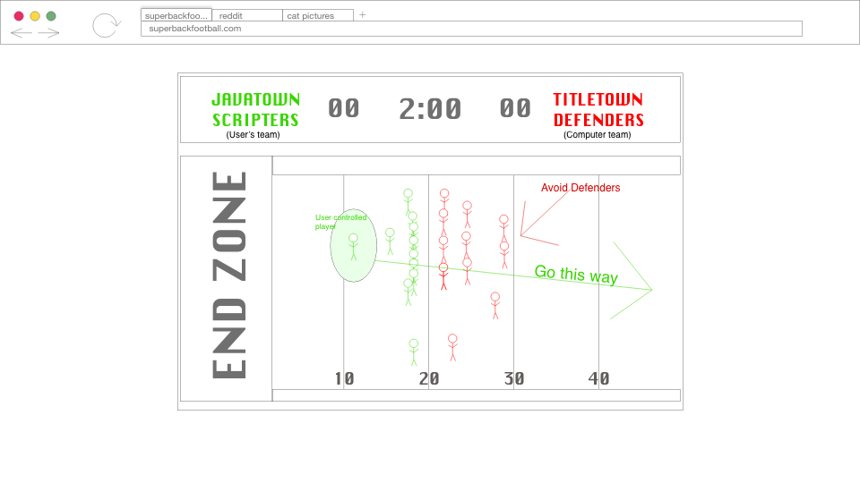
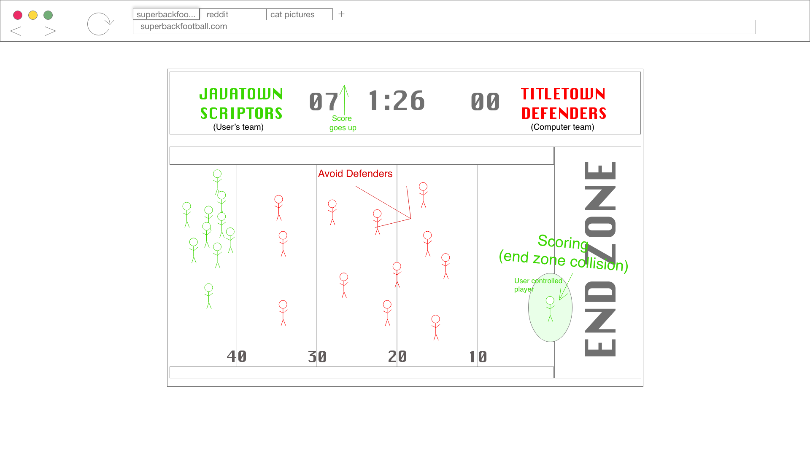
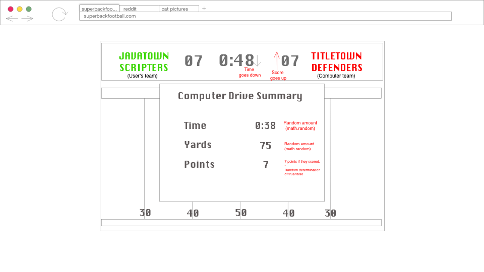

# Superback Football
This is a 2D, side-scrolling game. The game will start with the player on the left side of the canvas. The player must then navigate to the far right end of the canvas while avoiding defenders. A collision with a defender is a "tackle" and the play ends. Reaching the far end without being tackled results in a touchdown and earns 7 points. The opponent's scoring drive is then calculated with random outcomes to determine if they also scored 7 points. If the player can score more points than the opponent in the allotted time, they win the game. 

https://mylesw27.github.io/project-1/

## Approach Taken
The approach taken was to create a very basic football game and expand on it as I gained familiarity with the project. The first few iterations of the game had one block against a team of 11 different colored blocks. Eventually, I was able to add teammates, draw characters and implement them with animation. After tinkering with the game logic and computer scoring logic for several days, I eventually landed on the game speed and feel that it has today. My last step was implementing most of the transition screens an styling the game. 

## Tech Stack
- HTML
- CSS
- JavaScript 

## Wireframes

## MVP Goals
- Render a title screen
- Render a football field 
- Render the player and defenders 
- Determine computer's score and track scores
- Render a scoreboard that displays scores and time remaining
- End game when clock reached zero
- Render a win screen if player is the winner

## Post-project Reflection
I felt like a had tremendous growth as a developer during this project. The nature of the project required several instances of employing intervals and timeouts. These are concepts that I was not too familiar with before starting the project. By the end, I had a strong grasp on them and was using them with ease to create different situations and even animations. I also realize that my initial ideas for the game were too expansive to create in a week. I was able to create a complete game that I am proud of. However, the full execution of the game is not quite as expansive as the grand ideas I had when brainstorming for the game. Overall, I enjoyed working on this project and being able to explore the creative possibilities of the javascript canvas. 